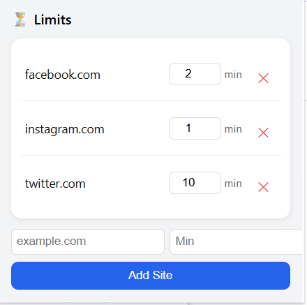

```md
# ⏳ Website Time Limiter (Chrome Extension)

A simple Chrome extension to limit time spent on distracting websites like Instagram, Facebook, and Twitter.

---

## 🚀 Features

- ⏱️ Set daily time limits per website  
- 🌐 Supports multiple websites  
- 📊 Real-time countdown timer (top-right overlay)  
- 🔄 Automatic daily reset  
- ➕ Add custom websites  
- ❌ Remove websites easily  

---

## 🧠 How It Works

- Tracks time only when a tab is active  
- Each site has its own time limit  
- Once the limit is reached → the site is blocked  
- Timer resets every day automatically  

---

## 📦 Project Structure

```

website-limiter/
│── manifest.json
│── background.js
│── content.js
│── popup.html
│── popup.js
│── blocked.html

```

---

## 🛠️ Installation (Local)

1. Clone the repository:
```

git clone [https://github.com/your-username/website-time-limiter.git](https://github.com/your-username/website-time-limiter.git)

```

2. Open Chrome and go to:
```

chrome://extensions/

```

3. Enable **Developer Mode** (top right)

4. Click **Load unpacked**

5. Select the project folder

---

## 🧪 Usage

1. Click the extension icon  
2. Set time limits for websites  
3. Open those websites  
4. Timer starts when tab is active  
5. Site gets blocked after limit is reached  

---

## ⚠️ Notes

- Works per Chrome profile  
- Requires manual refresh after extension reload  
- Only tracks active tab usage  

---

## 🔮 Future Improvements

- Sync across devices  
- Usage analytics dashboard  
- Strict mode (cannot disable easily)  
- Chrome Web Store publishing  

---

## 📸 Preview



---

## 📄 License

MIT License
```
